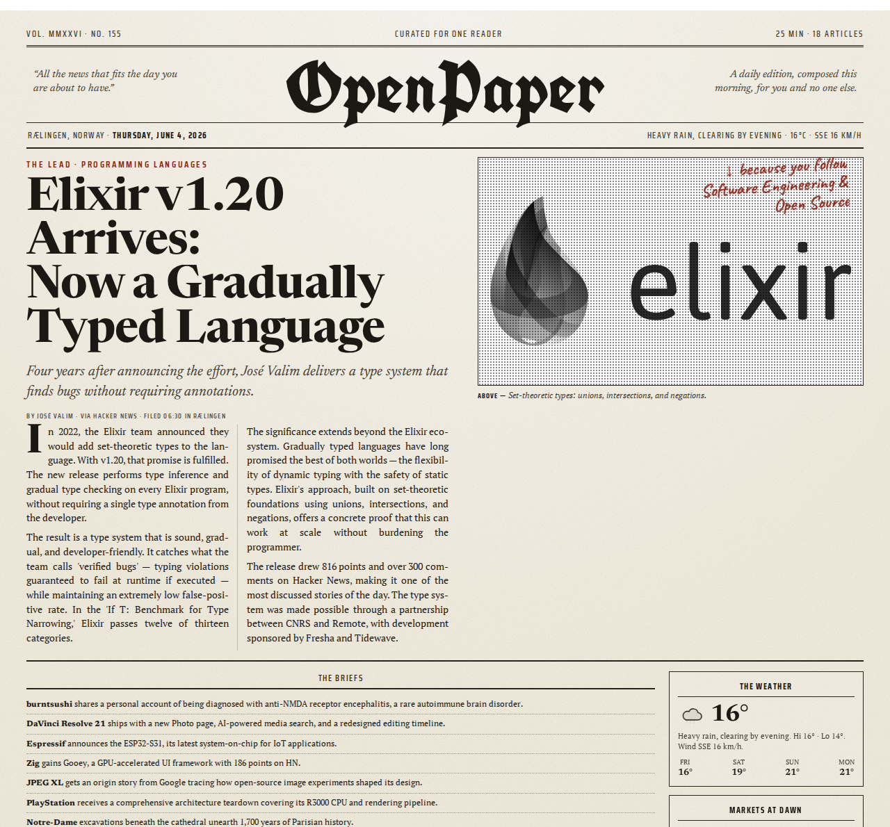

# OpenPaper

A personalized newspaper that knows only you will ever read it.

<p align="center">
  
</p>

OpenPaper is a Claude Code plugin that turns any collection of news sources into a single-reader daily newspaper. You point it at URLs, RSS feeds, or topics; it writes Python fetchers that scrape them deterministically, curates the articles to your taste, and renders the result as a broadsheet-style HTML page — complete with blackletter masthead, multi-column grid, halftone images, and animated ink-draw headlines.

There is no server, no account, no feed algorithm optimizing for engagement. Just your sources, your preferences, and a newspaper laid out for one.

## How it works

Three stages, each with a clear boundary:

1. **Ingest** — Add any news source. An agent analyzes the site and writes a standalone Python fetcher. Fetchers import shared utilities from a base module and run without AI on every subsequent invocation — deterministic, fast, auditable.
2. **Curate** — Claude filters, ranks, and selects articles based on your preference profile. Give feedback ("more climate", "fewer opinion pieces") and the profile sharpens over time.
3. **Present** — Claude assigns articles to layout slots and renders the edition using a Jinja2 broadsheet template.

### Ingestion pipeline

Under the hood, the Ingest stage runs in two phases:

1. **Listing** — Each fetcher runs in `--listing-only` mode, outputting article metadata (title, URL, date) without fetching content. RSS and API fetchers skip Playwright entirely in this phase. All fetchers run in parallel.
2. **Content** — The pipeline deduplicates listings against `seen.txt`, then batch-fetches full article text for new articles only, using a single shared Playwright browser. Paywall detection, content extraction, and HTML caching are centralized.

This architecture (inspired by [TriOnyx newsagg](https://github.com/tri-onyx/tri-onyx)) avoids wasted work: content is only fetched for articles that pass dedup, and the browser only launches when there's something new to fetch.

### Data layout

Your data lives in `.openpaper/` inside your project:

```
.openpaper/
├── sources/           # one .py file per source (+ _base.py shared module)
│   ├── _base.py       # shared utilities (deployed by fetch_all.py)
│   ├── hackernews.py
│   ├── bbc.py
│   ├── nrk.py
│   └── ...
├── preferences.md     # your interests + feedback history
├── incoming/          # articles awaiting curation
├── saved/             # archived articles from past editions
├── editions/          # rendered HTML newspapers
├── cache/             # per-source HTML + listing caches
└── seen.txt           # centralized dedup log (URLs)
```

## Curation engine: Claude or local

By default, OpenPaper curates with Claude — the agent acts as editor-in-chief.
You can instead opt into a **fully local, agent-free engine** that runs the whole
pipeline with a small local model via [Ollama](https://ollama.com) — private,
offline, free, and independent of a Claude Code session. The tradeoff is some
editorial polish.

The local engine is deliberately hybrid: all editorial *arithmetic* (interest
weights, the topic/source/serendipity caps, role assignment) stays deterministic
Python that mirrors the curation guide and is unit-tested; the model only does
per-article semantic matching and the summaries. That split is what lets a 4B
model produce a coherent paper.

Enable it in `.openpaper/config.yaml`:

```yaml
engine: local        # default: claude
model: gemma4:e4b    # gemma4:e4b recommended; e2b is too weak
```

Then make a paper from a plain shell:

```bash
ollama pull gemma4:e4b
uv run skills/openpaper/scripts/make_paper.py --data-dir .openpaper
```

See [the local engine guide](skills/openpaper/references/local-engine.md) for
details, model notes, and limits.

## Install

Requires [Claude Code](https://docs.anthropic.com/en/docs/claude-code) and [uv](https://docs.astral.sh/uv/). Playwright's Chromium must be installed once:

```bash
uv run playwright install chromium
```

### Standalone (own project)

Clone the repo and start Claude Code inside it:

```bash
git clone https://github.com/falense/openpaper.git
cd openpaper
claude
```

### Plugin (inside another project)

Install OpenPaper as a Claude Code plugin to use it from within any project:

```bash
claude plugin add https://github.com/falense/openpaper.git
```

The `/openpaper` skill and all commands will be available in your project. Your data (sources, editions, preferences) lives in `.openpaper/` inside your working directory — not inside the plugin.

## Usage

```
/openpaper
```

Or just say:
- "Make my paper"
- "Add nrk.no as a news source"
- "Show me the news"
- "I want more climate articles"

On first run, OpenPaper walks you through adding sources, setting preferences, and generating your first edition.

## Fetcher types

| Type | Listing method | When to use | Example sources |
|------|---------------|-------------|-----------------|
| **RSS** | `feedparser` + `urllib` | Site publishes an RSS/Atom feed | bbc, nrk, vg, openai, importai, thegradient |
| **Playwright** | Headless Chromium | JS-rendered listing page, no feed available | anthropic, deepmind, kode24 |
| **API** | `httpx` | Documented JSON API | hackernews |

Each fetcher is a standalone PEP 723 Python script — `uv run` handles dependencies automatically. See the [fetcher guide](skills/openpaper/references/fetcher-guide.md) for the full contract.

## Template

A single responsive broadsheet that scales from 375px mobile to 1960px desktop spread. Features UnifrakturCook blackletter masthead, paper grain, halftone image effects, and animated ink-draw headlines.

## License

MIT
